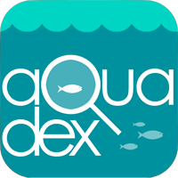

## Aquadex

**Aquadex allows you to help us help the Sea.**

It is a fun way to collect information, images, video and sound on the aquatic life around you.

#### Background:
Collecting marine and aquatic data is an important part of preserving our marine resources. At the same time it is very important to make the collected data available to interested community members, tourists and related researchers.  

#### The Problem
Collecting and sharing marine resource data can be a very lengthy and expensive process considering the enormity of our marine area and aquatic resources. At the same time we have heaps amount of open marine & aquatic data that people are interested in. Collaboration between these two streams of requirement can be through an effective and interactive process and providing a platform where people from each sector can interact with each other. Our goal is to make the process easier with the participation and collaboration of community members and researchers & data analysts.     

#### The Solution
Aquadex provides a mediator solution to exhibit aquatic data through an app in a consolidated way. So the user can just open the app and then select a location of his/her particular interest or next venture. It then invites user to accept challenges of aquatic data collection. At the same time Aquadex provides an interactive and pleasant way of collecting data and logging data using through gaming and “Augmented Reality”. Fun & adventure are two basic human interests and the app uses these to encourage people to actively participate in data collection and ultimately contributing to preserve marine & aquatic resources for our future generations.       

#### How It Works:
Aquadex uses a range of aquatic and marine data. It also collects and process data provided by Aquadex users. It then combines open & user data and provides a consolidated view. Users can get a list of locations marine resources of their interest like - dolphins, whales, fish species and frequency of their sightings. Then there is a list of challenges for user to collect data and share on Aquadex. Here we have included gaming logic and used our “Augmented Reality” API to make it most interactive way of collecting data.

Our game-logic enables user to participate in a contest with other app users and score points. Users are encouraged through a range of gift-cards and aquatic points. Our Augmented Reality engine, although in a POC right now, provides a very interactive and amusing way to locate & guide you to your next challenge through markers & direction. The key concept is to use the mobile device sensors, mainly accelerometer, magnetometer, GPS, camera to establish the current location, orientation and point-of-view (in terms of camera viewport) of the device. On top, of the camera feed on the phone screen, data is superimposed in transparent/semi-transparent layers. This is done by creating virtual markers based on geolocated dataset(s) and using algorithms to determine the approximate distance and direction of heading for the marker in relation to the user's (and phone camera's) point-of-view. Navigation features can be added by using the phone's motion sensors to determine direction of movement as well.

Team name: Bob's gang

Team memebers: Matt Cejko, Martin Nobis, Muhammad Pavel, Mizanur Rahman, Asheshwor Shrestha, Oshim Somers

Demo url: https://github.com/Unleashed2016/aquadex

Video url:

Hackerspace url: https://2016.hackerspace.govhack.org/node/1766

### Local Event Location:

Adelaide

### Datasets Used:

* Aquatic Ecosystem Condition Reports - Environment Protection Authority (EPA) - South Australia
https://data.sa.gov.au/data/dataset/aquatic-ecosystem-condition-reports The aquatic ecosystems condition data provides details on water quality, aquatic habitats and protected sites which provides the locations of specific species for our platform. The data also provides information on water quality on the sites featured on our app.

* Shorebased Recreational Fishing - Dept of Environment, Water and Natural Resources
https://data.sa.gov.au/data/dataset/shore-based-recreational-fishing The recreational fishing related locations will be used to guide users of Aquadex app. The spatial data will be used for map display as well as augmented reality interfaces.

* Jetties - DPTI
https://data.sa.gov.au/data/dataset/jetties/resource/b617df1e-345b-47e4-a61e-445487a2be9f The spatial data is used to visualize locations of related activities in our app using interactive maps and augmented reality interface.

* South Australian Boat Ramp Locator - DPTI http://data.gov.au/dataset/05546e03-2997-4762-a439-0f2e9a492650 The spatial data is used to visualize locations of related activities in our app using interactive maps and augmented reality interface.

* Whale Sightings Log - SA Whale Centre
http://www.sawhalecentre.com/whale-sightings/sightings-log/?mc_cid=00ccaf0043&mc_eid=3b8b4f019a Current and past whale sightings logs will be used used to extract location data and descriptions to be displayed through aquadex app.

* South Australian Shipwrecks Database https://data.sa.gov.au/data/dataset/shipwrecks The spatial data is used to visualize locations of past shipwrecks using interactive maps and augmented reality interface.

### APIs Used

* Awe.js: Used to simplify using HTML5 geolocation, orientation and WebGL

* Three.js: Used as a cool WebGL library

* Google Maps JS API: Used to superimpose a layer of Roads and Streets with names on top of the camera feed.

* Google Maps Directions API: Used for routing and navigation from user's current location to destination (location of restaurant, club, etc.)

* Backendless: On-demand Mobile Backend as a Service (mBaaS) platform.
